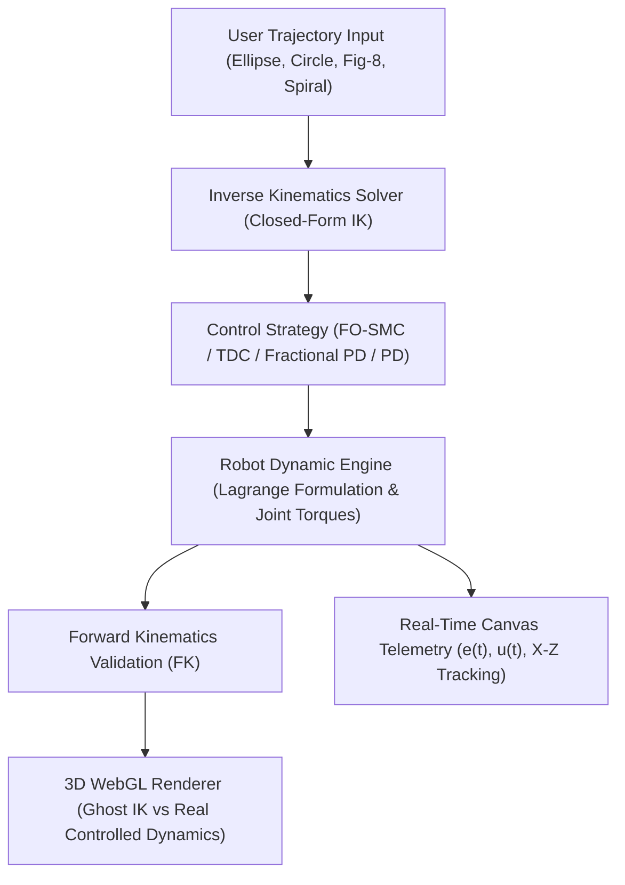

# Master PFE — Conception, Réalisation et Commande par Mode Glissant d'Ordre Fractionnaire d'un Robot Parallèle de Type Delta

<div align="center">

[](https://djidelabdelali.github.io/pfe/)
[](https://github.com/DjidelAbdelali/pfe/blob/main/memoire_docs/Memoire_PFE_USTHB.pdf)
[](https://view.officeapps.live.com/op/view.aspx?src=https%3A%2F%2Fraw.githubusercontent.com%2FDjidelAbdelali%2Fpfe%2Fmain%2Fmemoire_docs%2FPresentation_PFE_USTHB.pptx)
[](https://djidelabdelali.github.io/portfolio/)
[](https://github.com/DjidelAbdelali/pfe)

</div>

---

## 📌 Project Overview

This repository contains the complete Master’s Thesis project (**Projet de Fin d'Études - PFE**) in Systems & Automation Engineering at **USTHB** (*Université des Sciences et de la Technologie Houari Boumediene*).

### 🎓 Academic Information
- **Title**: *Conception, réalisation et commande par mode glissant d'ordre fractionnaire d'un robot parallèle de type Delta*
- **Authors**: **DJIDEL Abdelali Rayan** & **ZETOUTOU Djedjiga Lyna**
- **Supervisor**: **Dr. BOUDJEDIR Chems Eddin**
- **Jury**: Dr. LAIB Abdelbasset (President), Dr. GUESSOUM Hani (Examiner)
- **Institution**: USTHB — Faculté d'Électronique et d'Informatique, Département d'Automatique
- **Date**: June 2025

The project combines 3D CAD mechanical design in SolidWorks, dynamic closed-loop controller simulations in MATLAB/Simulink, hardware/software implementation in ROS 2 (URDF), and an interactive WebGL 3D simulator for real-time kinematic and dynamic tracking visualization.

---

## 📄 Thesis & Defense Materials (Working Links)

- 📖 **[View Thesis PDF Document](https://github.com/DjidelAbdelali/pfe/blob/main/memoire_docs/Memoire_PFE_USTHB.pdf)** *(Integrated GitHub PDF Viewer)*
- ⬇️ **[Download Thesis PDF (Raw)](https://raw.githubusercontent.com/DjidelAbdelali/pfe/main/memoire_docs/Memoire_PFE_USTHB.pdf)**
- 📊 **[View Defense Slides Online](https://view.officeapps.live.com/op/view.aspx?src=https%3A%2F%2Fraw.githubusercontent.com%2FDjidelAbdelali%2Fpfe%2Fmain%2Fmemoire_docs%2FPresentation_PFE_USTHB.pptx)** *(Office Online Web Viewer)*
- ⬇️ **[Download Presentation PPTX](https://raw.githubusercontent.com/DjidelAbdelali/pfe/main/memoire_docs/Presentation_PFE_USTHB.pptx)**

---

## 🏗️ System Architecture & Data Flow



---

## ⚙️ Control Strategies & Mathematical Formulations

This work focuses on robust trajectory tracking of parallel Delta manipulators using **Fractional-Order Sliding Mode Control (FO-SMC)** and **Time Delay Control (TDC)**.

### 1. Proposed Fractional Sliding Surface ($S_1$)
$$S_1(t) = D^\alpha e(t) + \lambda e(t)$$
where $D^\alpha$ is the fractional derivative operator of order $\alpha \in (0, 1)$, $e(t) = q_d(t) - q(t)$ is the tracking error, and $\lambda > 0$ is a positive gain matrix.

### 2. Evaluated Controllers:
1. **Proposed Surface $S_1$ + Saturation Function**: Eliminates high-frequency chattering while preserving robustness against model uncertainties.
2. **Proposed Surface $S_1$ + DHRL**: Dynamic Reaching Law for adaptive switching gain reduction.
3. **Comparison Surface $S_2$**: Standard sliding mode control surface for performance benchmark.
4. **Fractional-Order PD (PD-F)**: $u(t) = K_p e(t) + K_d D^\beta e(t)$.
5. **Classical PD**: Benchmark proportional-derivative controller.

---

## 📁 Repository Directory Structure

```
pfe/
├── index.html                   # Interactive 3D WebGL Simulator (GitHub Pages Entry Point)
├── style.css                    # Dark Cyberpunk UI Theme & Glassmorphic Layout
├── app.js                       # Real-Time Telemetry, Trajectory Player & Chart Handlers
├── dynamics.js                  # Fractional SMC & TDC Dynamic Numerical Physics Engine
├── kinematics.js                # Closed-Form Inverse & Forward Kinematics Solvers
├── robot3d.js                   # Three.js WebGL Scene, STL Mesh Loader & Joint Mating
├── stl/                         # 3D CAD Mesh STL Assets (base, arms, joints, end-effector)
│
├── memoire_docs/                # Thesis Documentation & Presentation
│   ├── Memoire_PFE_USTHB.pdf    # Full Master's Thesis (PDF, USTHB 2025)
│   ├── Presentation_PFE_USTHB.pptx # Defense Slide Deck (PPTX)
│   └── figures/                 # Trajectory Tracking & Error Metric Figures (PNG)
│
├── matlab_simulink/             # Controller Simulations & Benchmarks
│   ├── run_all_simulations.m    # Automated Benchmark Execution Script
│   ├── simulation_results.csv   # Performance Indicators (ISE, IAE, Chattering Index)
│   ├── simulation_results.mat   # Raw Time-Series Results
│   ├── S1_DHRLs.slxc            # Target Simulink Model Cache
│   ├── Surface proposee/        # Proposed FO-SMC Models (S1+Sat & S1+DHRL)
│   ├── Surface de comparaison/  # Standard SMC Models (Surface S2)
│   ├── PD et PD-F/              # Fractional & Classical PD Models
│   └── exemple de code d'optimisation/ # Genetic Gain Tuning Scripts
│
├── cad_3d/                      # SolidWorks Mechanical Conception
│   ├── 3D Modeling/             # Sub-assembly Folders & Parts
│   ├── 608-z.SLDASM             # Ball Bearing & Frame Assembly
│   ├── Assem12-Copy - Copy.SLDASM # Full Delta Robot Kinematic Assembly
│   └── *.SLDPRT                 # Stepper Motors, Arms, Idlers, Base & End-Effector Parts
│
└── ros2_ws/                     # ROS 2 Control Implementation
    └── src/                     # ROS 2 Packages (URDF Specifications, Nodes, Launch Files)
```

---

## 🚀 Live Interactive Web Simulator

Interact with the 3D Delta Robot simulator directly in your browser:
🔗 **[Launch Interactive Web Simulator](https://djidelabdelali.github.io/pfe/)**

---

## 🔗 Connected Portfolio Ecosystem

- 🌐 **Main Portfolio**: [djidelabdelali.github.io/portfolio](https://djidelabdelali.github.io/portfolio/)
- 💻 **GitHub Profile**: [github.com/DjidelAbdelali](https://github.com/DjidelAbdelali)
- 💼 **LinkedIn Profile**: [DJIDEL Abdelali Rayan](https://linkedin.com/in/djidel-abdelali-rayan-814b25207)

---

<div align="center">
  <sub>Developed by DJIDEL Abdelali Rayan — Systems & Automation Engineering (USTHB)</sub>
</div>
