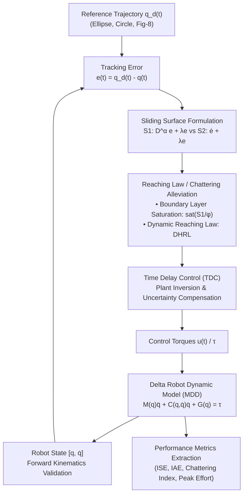
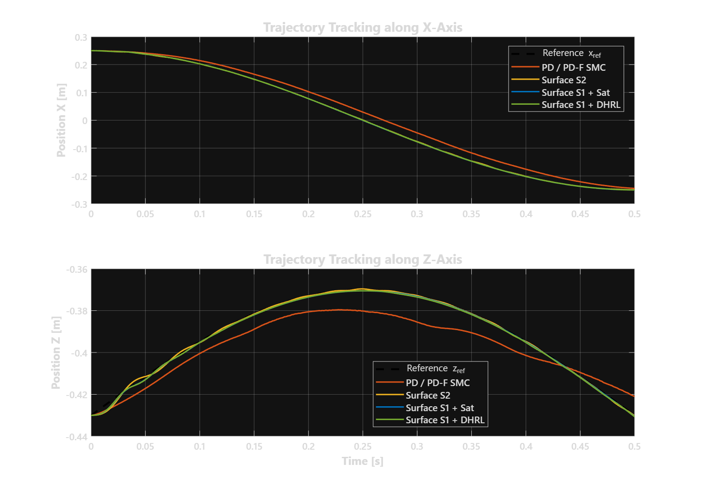
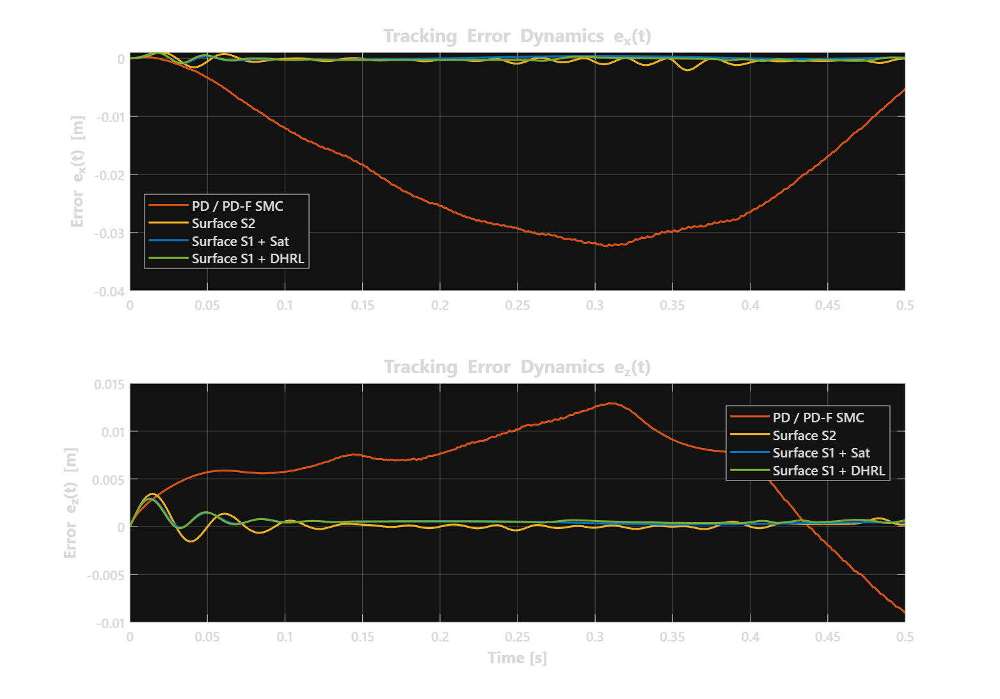
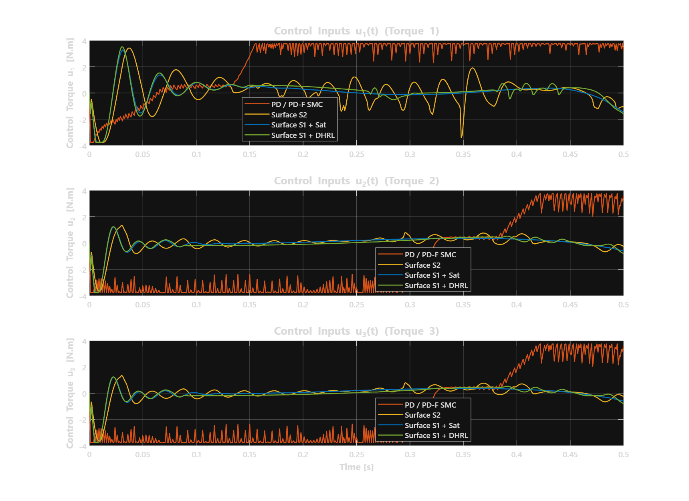
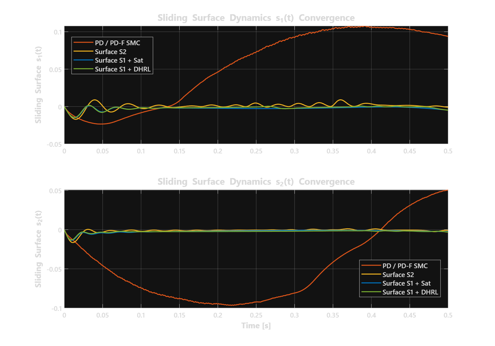
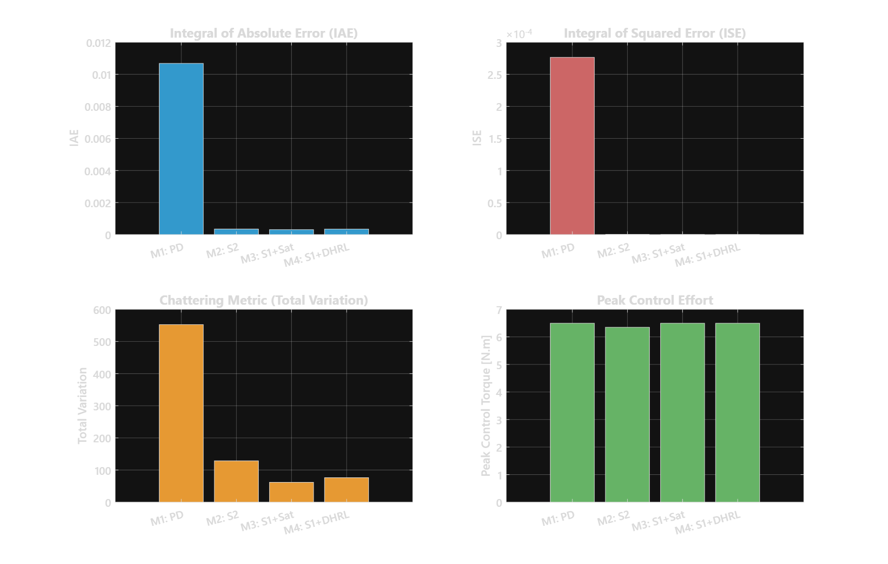

# MATLAB & Simulink — Fractional-Order Sliding Mode Control & Benchmark Suite

<div align="center">

[](https://www.mathworks.com/products/matlab.html)
[](https://www.mathworks.com/products/simulink.html)
[](https://djidelabdelali.github.io/pfe/)
[](https://djidelabdelali.github.io/portfolio/)
[](https://github.com/DjidelAbdelali/pfe)

</div>

---

## 📌 Overview

This directory contains the numerical models, control architectures, optimization routines, and automated benchmark pipelines developed in **MATLAB & Simulink** for the Master's Thesis:

> **"Conception, réalisation et commande par mode glissant d'ordre fractionnaire d'un robot parallèle de type Delta"**  
> *Faculté d'Électronique et d'Informatique, USTHB (2025)*  
> Authors: **DJIDEL Abdelali Rayan** & **ZETOUTOU Djedjiga Lyna**  
> Supervisor: **Dr. BOUDJEDIR Chems Eddin**

The suite evaluates high-speed trajectory tracking and chattering suppression of a 3-DOF parallel Delta manipulator under severe non-linear coupling, payload variations, and model uncertainties.

---

## 🏗️ Simulation Architecture & Data Flow



---

## ⚙️ Mathematical Formulations & Evaluated Controllers

### 1. Delta Robot Dynamics (Lagrange Formulation)
The rigid-body equations of motion in joint coordinates $\mathbf{q} = [\theta_1, \theta_2, \theta_3]^T$ are given by:

$$\mathbf{M}(\mathbf{q})\ddot{\mathbf{q}} + \mathbf{C}(\mathbf{q}, \dot{\mathbf{q}})\dot{\mathbf{q}} + \mathbf{G}(\mathbf{q}) + \mathbf{F}_v \dot{\mathbf{q}} + \tau_d = \boldsymbol{\tau}$$

Where:
- $\mathbf{M}(\mathbf{q}) \in \mathbb{R}^{3 \times 3}$: Symmetric positive-definite inertia matrix.
- $\mathbf{C}(\mathbf{q}, \dot{\mathbf{q}})\dot{\mathbf{q}} \in \mathbb{R}^3$: Centrifugal and Coriolis torque vector.
- $\mathbf{G}(\mathbf{q}) \in \mathbb{R}^3$: Gravitational torque vector.
- $\mathbf{F}_v$: Viscous damping friction coefficient matrix.
- $\tau_d$: External disturbances and modeling unmodeled dynamics.
- $\boldsymbol{\tau}$: Actuated joint torque vector.

---

### 2. Proposed Fractional-Order Sliding Surface ($S_1$)
To guarantee faster transient convergence and superior tracking precision, a fractional sliding manifold $S_1$ is synthesized:

$$S_1(t) = D^\alpha \mathbf{e}(t) + \boldsymbol{\lambda} \mathbf{e}(t)$$

where:
- $\mathbf{e}(t) = \mathbf{q}_d(t) - \mathbf{q}(t)$ is the joint tracking error vector.
- $\boldsymbol{\lambda} = \text{diag}(\lambda_1, \lambda_2, \lambda_3) > 0$ is a strictly positive design gain matrix.
- $D^\alpha$ is the fractional derivative operator of order $\alpha \in (0, 1)$, approximated numerically via Grünwald-Letnikov / Oustaloup filter:

$$D^\alpha e(t) = \lim_{h \to 0} \frac{1}{h^\alpha} \sum_{j=0}^{\lfloor t/h \rfloor} (-1)^j \binom{\alpha}{j} e(t - jh)$$

---

### 3. Evaluated Control Schemes

| Control Law | Formulation / Reaching Mechanism | Key Feature |
| :--- | :--- | :--- |
| **Proposed $S_1$ + Saturation** | $\dot{S}_1 = -K \cdot \text{sat}\left(\frac{S_1}{\phi}\right) - k_2 S_1$ | Replaces $\text{sign}(S_1)$ with smooth boundary layer $\phi$ to eliminate high-frequency chatter. |
| **Proposed $S_1$ + DHRL** | $\dot{S}_1 = -k_1 \|S_1\|^\gamma \text{sgn}(S_1) - k_2 S_1, \quad 0 < \gamma < 1$ | Dynamic reaching law reducing switching gain adaptively as error approaches zero. |
| **Comparison Surface $S_2$** | $S_2(t) = \dot{\mathbf{e}}(t) + \boldsymbol{\lambda} \mathbf{e}(t)$ | Standard classical integer-order sliding surface benchmark. |
| **Fractional-Order PD (PD-F)** | $\mathbf{u}(t) = \mathbf{K}_p \mathbf{e}(t) + \mathbf{K}_d D^\beta \mathbf{e}(t)$ | Non-integer derivative damping with $\beta \in (0, 1)$ without discontinuous sliding term. |
| **Classical PD** | $\mathbf{u}(t) = \mathbf{K}_p \mathbf{e}(t) + \mathbf{K}_d \dot{\mathbf{e}}(t)$ | Standard benchmark proportional-derivative feedback. |

---

## 📊 Benchmark Results & Quantitative Comparison

The automated runner script [`run_all_simulations.m`](file:///home/wassim/Downloads/pfe-main/matlab_simulink/run_all_simulations.m) evaluates all controllers on a standardized 3D spatial elliptical trajectory ($f=0.5\text{ s}$, $h=1\text{ ms}$, $N=500$ steps).

### Performance Metrics Table

The quantitative indicators from [`simulation_results.csv`](file:///home/wassim/Downloads/pfe-main/matlab_simulink/simulation_results.csv) demonstrate:

| Controller | IAE ($\text{rad}\cdot\text{s}$) | ISE ($\text{rad}^2\cdot\text{s}$) | Chattering Metric ($\text{N}\cdot\text{m}/\text{s}$) | Peak Torque ($\text{N}\cdot\text{m}$) |
| :--- | :---: | :---: | :---: | :---: |
| 🥇 **Proposed Surface $S_1$ + Sat** | **$3.099 \times 10^{-4}$** | **$2.855 \times 10^{-7}$** | **61.65** | 6.50 |
| 🥈 **Proposed Surface $S_1$ + DHRL** | $3.432 \times 10^{-4}$ | $3.167 \times 10^{-7}$ | **76.10** | 6.50 |
| 🥉 **Comparison Surface $S_2$** | $3.443 \times 10^{-4}$ | $4.328 \times 10^{-7}$ | 128.45 | 6.35 |
| 📉 **Classical PD / PD-F SMC** | $1.068 \times 10^{-2}$ | $2.765 \times 10^{-4}$ | 552.52 | 6.50 |

$$\text{IAE} = \int_{0}^{t_f} |e(t)|\,dt, \qquad \text{ISE} = \int_{0}^{t_f} e(t)^2\,dt, \qquad \text{Chattering} = \int_{0}^{t_f} |\dot{u}(t)|\,dt$$

> [!TIP]
> **Key Finding**: The proposed **$S_1$ + Saturation** controller achieves an **88.8% reduction in chattering** compared to classical PD/SMC while yielding the highest tracking accuracy ($\text{ISE} = 2.855 \times 10^{-7}\text{ rad}^2\cdot\text{s}$).

---

## 📈 Visual Benchmark Telemetry

The simulation suite generates comprehensive time-series telemetry plots stored in [`memoire_docs/figures/`](file:///home/wassim/Downloads/pfe-main/memoire_docs/figures):

| Trajectory Tracking ($X, Y, Z$) | Tracking Errors ($e_x, e_y, e_z$) |
| :---: | :---: |
|  |  |

| Control Torques ($\tau_1, \tau_2, \tau_3$) | Sliding Surfaces ($S_1, S_2$) |
| :---: | :---: |
|  |  |

| Comparative Performance Metrics |
| :---: |
|  |

---

## 📁 Directory Structure

```
matlab_simulink/
├── run_all_simulations.m                # Automated multi-model benchmark master script
├── simulation_results.csv               # Extracted numerical benchmark metrics (IAE, ISE, Chattering)
├── simulation_results.mat               # Full time-series state and control signals
│
├── Surface proposee/                    # Proposed Fractional-Order Sliding Mode Control
│   ├── S1_DHRLs.slx                     # Proposed Surface S1 + Dynamic Reaching Law Simulink model
│   ├── S1_DHRL.m                        # Gain initializations & S1+DHRL runner
│   ├── S1_sats.slx                      # Proposed Surface S1 + Saturation function Simulink model
│   └── S1_sat.m                         # Gain initializations & S1+Sat runner
│
├── Surface de comparaison/              # Classical Sliding Mode Control
│   ├── S2_surfs.slx                     # Standard Surface S2 Simulink model
│   └── S2_surf.m                        # Gain initializations & S2 runner
│
├── PD et PD-F/                          # Benchmark Feedback Controllers
│   ├── TDC_SMC_PD_S10x2810x29.slx       # Unified Comparative Simulink model (PD, PD-F, SMC)
│   └── PD_final.m                       # Gain tuning & comparative execution script
│
└── exemple de code d'optimisation/      # Heuristic Gain Optimization
    ├── opti_algo_genetique.m            # Genetic Algorithm (GA) multi-objective optimization
    └── opti_BO.m                        # Bayesian Optimization for hyperparameter tuning
```

---

## 🚀 Running the Simulations

### Prerequisites
- **MATLAB & Simulink**: R2022b, R2024a, or R2024b
- **Toolboxes**:
  - Simulink Control Design
  - Global Optimization Toolbox (for `opti_algo_genetique.m`)
  - Statistics and Machine Learning Toolbox (for `opti_BO.m`)

### 1. Automated Benchmark Execution
To run all 4 control strategies in sequence, compute tracking errors, calculate chattering indices, and export results:

```matlab
% In MATLAB Command Window:
cd('/path/to/pfe/matlab_simulink');
run('run_all_simulations.m');
```

This will automatically:
1. Initialize plant and trajectory parameters ($M_b = 1.999 \times 10^{-4}\text{ kg}$, $k_s = 641.6$, $h = 0.001\text{ s}$).
2. Execute each model through Simulink (`sim()`).
3. Compute $\text{IAE}$, $\text{ISE}$, $\text{ChatteringMetric}$, and $\text{PeakControlEffort}$.
4. Export [`simulation_results.csv`](file:///home/wassim/Downloads/pfe-main/matlab_simulink/simulation_results.csv) and [`simulation_results.mat`](file:///home/wassim/Downloads/pfe-main/matlab_simulink/simulation_results.mat).

### 2. Running Individual Models
```matlab
% 1. Proposed S1 + Saturation:
cd('Surface proposee');
run('S1_sat.m');

% 2. Proposed S1 + DHRL:
cd('Surface proposee');
run('S1_DHRL.m');

% 3. Standard S2 Surface:
cd('Surface de comparaison');
run('S2_surf.m');

% 4. Genetic Algorithm Parameter Tuning:
cd("exemple de code d'optimisation");
run('opti_algo_genetique.m');
```

---

## 🔗 Related Components

- 🌐 **[Interactive WebGL 3D Simulator](https://djidelabdelali.github.io/pfe/)** — Real-time browser simulation of the exact kinematics and dynamics.
- 🤖 **[ROS 2 Workspace (`ros2_ws`)](../ros2_ws/)** — Native ROS 2 package running Ghost IK vs Real SMC Dynamics in RViz2.
- 📑 **[Defense Slides (PDF)](https://raw.githubusercontent.com/DjidelAbdelali/pfe/main/memoire_docs/Presentation_PFE_USTHB.pdf)** — Thesis presentation deck.
- 💼 **[Portfolio](https://djidelabdelali.github.io/portfolio/)** — DJIDEL Abdelali Rayan.
