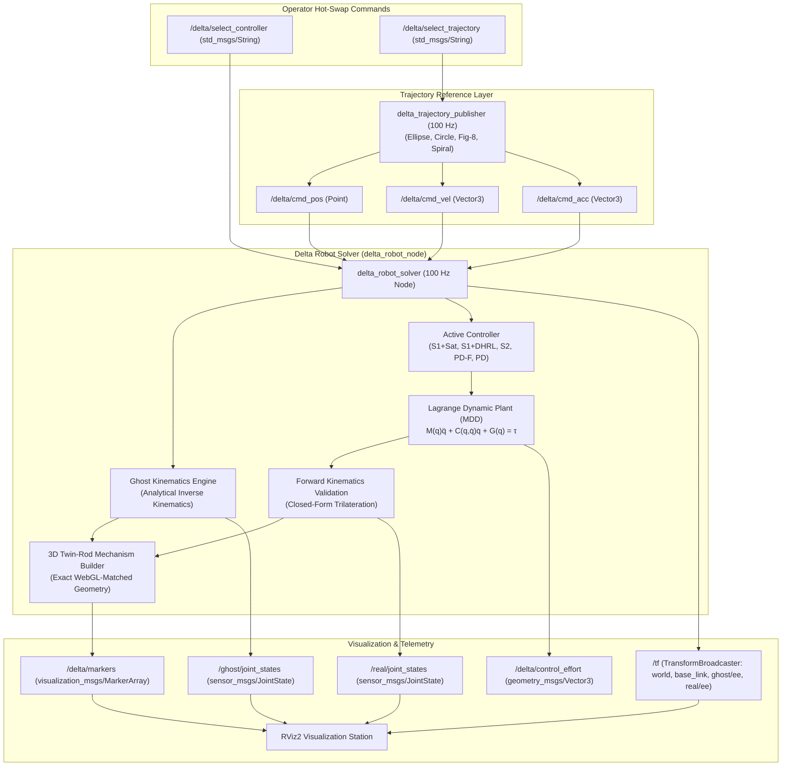

# Dual Delta Robot ROS 2 — High-Speed Parallel Manipulator Simulation, Dynamics & Fractional SMC

<div align="center">

[](https://docs.ros.org/)
[](https://github.com/ros2/rviz)
[](https://docs.ros.org/en/jazzy/p/rclpy/)
[](https://djidelabdelali.github.io/pfe/)
[](https://djidelabdelali.github.io/portfolio/)
[](https://github.com/DjidelAbdelali/pfe)

</div>

---

## 📌 Project Overview

This ROS 2 workspace provides a complete robotic simulation and control environment for a **3-DOF Parallel Delta Manipulator**, developed as part of the Master's Thesis (**PFE**) in Systems & Automation Engineering at **USTHB** (*Université des Sciences et de la Technologie Houari Boumediene*).

The implementation bridges mathematical closed-loop formulation with modern ROS 2 robotics tooling:
- **Dual Robot Architecture**: Simultaneously simulates a kinematic **Ghost Robot** (ideal closed-form Inverse Kinematics target) alongside the **Real Controlled Robot** (governed by nonlinear Lagrange rigid-body dynamics, actuator torque constraints, and sliding mode controllers).
- **Exact Parallel Closed-Chain Modeling**: Closed kinematic chains cannot be solved by tree-based URDF `robot_state_publisher` alone. This node calculates analytical 3D spatial geometry in real time and renders the exact mechanism with twin parallel rods, ball joints, moving nacelle, tool cone, and base motors.
- **Fractional Sliding Mode Control (FO-SMC)**: Implements proposed fractional sliding surface $S_1 = D^\alpha e + \lambda e$ with boundary-layer saturation and dynamic reaching law (DHRL) alongside standard benchmarks ($S_2$, PD-F, classical PD).
- **Runtime Hot-Swapping**: Switch active controllers and target trajectories on-the-fly via ROS 2 topic dispatches without restarting nodes.

---

## 👥 Project Contributors & Collaboration

- 🎓 **DJIDEL Abdelali Rayan** ([@DjidelAbdelali](https://github.com/DjidelAbdelali)) — *Robotics & Systems Engineer*
  - Dual-robot ROS 2 architecture, exact parallel kinematic solver, numerical Lagrange dynamics engine, fractional-order SMC controllers, MarkerArray geometry publisher, and RViz2 visualization pipeline.
- 🎓 **ZETOUTOU Djedjiga Lyna** — *Co-Author*
  - Trajectory profiling, kinematic trilateration validation, and benchmark evaluation.
- 👨‍🏫 **Dr. BOUDJEDIR Chems Eddin** — *Thesis Supervisor*

---

## 🏗️ System Architecture & Data Flow



---

## ⚙️ Core Technical Capabilities

### 1. Dual-Robot Architecture (Ghost IK vs Real Dynamics)
The node renders two synchronized robots side-by-side:
- **Ghost Robot (Teal / Translucent)**: Directly displays ideal analytical Inverse Kinematics tracking $\mathbf{q}_d(t) = \text{IK}(\mathbf{X}_d(t))$.
- **Real Robot (Solid / Dynamic)**: Computes control torques $\boldsymbol{\tau}(t)$, integrates forward through the nonlinear manipulator dynamics $\mathbf{M}(\mathbf{q})\ddot{\mathbf{q}} + \mathbf{C}(\mathbf{q}, \dot{\mathbf{q}})\dot{\mathbf{q}} + \mathbf{G}(\mathbf{q}) = \boldsymbol{\tau}$, and displays actual platform response with physical inertia and torque saturation.
- **Trajectory Trails**: Real-time 250-point breadcrumb trails for instant visual inspection of tracking error $\mathbf{e}(t) = \mathbf{X}_d(t) - \mathbf{X}(t)$.

### 2. Exact Closed-Chain Parallel Mechanism Visualization
Unlike serial arms, parallel Delta robots consist of three closed loops with dual parallelogram forearm rods. The node generates a comprehensive `MarkerArray` that models:
- **Actuated Biceps Arms**: Revolute joints driven by base stepper motors ($L_1 = 0.20\text{ m}$).
- **Twin Forearm Rods**: Dual parallel rods per arm with spherical ball joints ($L_2 = 0.40\text{ m}$, rod spacing $d_{\text{offset}} = 0.05\text{ m}$).
- **Moving Platform & Nacelle**: Hexagonal travelling platform ($r_p = 0.04\text{ m}$) with end-effector tool cone.
- **Base Frame & Motor Shells**: Fixed triangular base frame ($r_b = 0.15\text{ m}$) with 3 motor housings.

### 3. Hot-Swappable Fractional Controllers
Commutate between 5 evaluated control laws in real time without restarting:
- **`s1sat`**: Proposed Fractional Sliding Surface $S_1 = D^\alpha e + \lambda e$ with boundary layer saturation $\text{sat}(S_1/\phi)$ (eliminates chattering).
- **`s1dhrl`**: Proposed Surface $S_1$ with Dynamic Reaching Law $\dot{S}_1 = -k_1 |S_1|^\gamma \text{sgn}(S_1) - k_2 S_1$.
- **`s2`**: Integer-order sliding surface benchmark $S_2 = \dot{e} + \lambda e$.
- **`pdf`**: Fractional-Order PD controller $\mathbf{u} = \mathbf{K}_p \mathbf{e} + \mathbf{K}_d D^\beta \mathbf{e}$.
- **`pd`**: Classical proportional-derivative benchmark.

```bash
# Switch to S1 with Saturation:
ros2 topic pub --once /delta/select_controller std_msgs/msg/String "{data: 's1sat'}"

# Switch to S1 with Dynamic Reaching Law:
ros2 topic pub --once /delta/select_controller std_msgs/msg/String "{data: 's1dhrl'}"
```

### 4. Dynamic Trajectory Profiler
The `trajectory_publisher` node generates smooth analytical references with continuous position, velocity, and acceleration feeds at 100 Hz:
- **`ellipse`**: 3D spatial ellipse with sinusoidal Z heave ($X=0.05\cos(\omega t)$, $Y=0.03\sin(\omega t)$, $Z=-0.18+0.01\sin(2\omega t)$).
- **`circle`**: Planar circle ($R=0.04\text{ m}$, $Z=-0.18\text{ m}$).
- **`figure8`**: Lemniscate of Gerono ($X=0.04\sin(\omega t)$, $Y=0.04\sin(2\omega t)$, $Z=-0.18\text{ m}$).
- **`spiral`**: Expanding Archimedean spiral.

```bash
# Switch trajectory reference to Figure-8:
ros2 topic pub --once /delta/select_trajectory std_msgs/msg/String "{data: 'figure8'}"
```

---

## 📁 Repository Directory Structure

```
ros2_ws/
├── run_simulation.sh                    # One-click launch script (Environment sourcing + RViz2 bringup)
├── src/
│   └── delta_robot_pkg/                 # Core ROS 2 package
│       ├── package.xml                  # Package dependencies & manifest
│       ├── setup.py                     # Python package build configuration
│       ├── setup.cfg                    # Setuptools installation script options
│       │
│       ├── delta_robot_pkg/             # Python modules
│       │   ├── __init__.py
│       │   ├── delta_robot_node.py      # Master controller node, Lagrange dynamics, & MarkerArray builder
│       │   ├── trajectory_publisher.py  # 100 Hz continuous reference trajectory generator
│       │   ├── kinematics.py            # Closed-form Inverse (MGI) & Forward (MGD) kinematics
│       │   └── dynamics.py              # MDD rigid-body inertia, Coriolis, and gravity matrices
│       │
│       ├── launch/
│       │   └── dual_robot_rviz.launch.py # Layered launch: Ghost RSP + Real RSP + Solver + Trajectory + RViz2
│       │
│       ├── rviz/
│       │   └── dual_robot.rviz          # Optimized RViz2 display config (MarkerArray, RobotState, TF, Grid)
│       │
│       └── urdf/
│           ├── delta_robot.urdf.xacro   # Delta robot URDF specification & base geometry
│           └── delta_robot.urdf         # Compiled URDF reference
```

---

## 🚀 Quick Start & Installation

### 1. Prerequisites
- **Operating System**: Ubuntu 22.04 LTS (Jammy) or Ubuntu 24.04 LTS (Noble)
- **ROS 2 Distribution**: ROS 2 Humble Hawksbill or ROS 2 Jazzy Jalisco
- **Python Dependencies**:
  ```bash
  sudo apt install -y python3-colcon-common-extensions python3-rosdep ros-$ROS_DISTRO-xacro ros-$ROS_DISTRO-rviz2 ros-$ROS_DISTRO-robot-state-publisher
  ```

### 2. Workspace Setup & Compilation
```bash
# Navigate to workspace
cd /path/to/pfe/ros2_ws

# Build with symlink install for rapid Python iteration
source /opt/ros/$ROS_DISTRO/setup.bash
colcon build --symlink-install

# Source workspace overlay
source install/setup.bash
```

### 3. Launch Full Simulation Stack
Launch the complete dual-robot simulation with a single command:

```bash
# Option A: Using the convenient launcher script
./run_simulation.sh

# Option B: Direct ROS 2 launch command
ros2 launch delta_robot_pkg dual_robot_rviz.launch.py
```

This brings up:
1. `ghost_robot_state_publisher` in `/ghost` namespace.
2. `real_robot_state_publisher` in `/real` namespace.
3. `delta_robot_solver` physics & control node at 100 Hz.
4. `delta_trajectory_publisher` reference generator at 100 Hz.
5. `rviz2` loaded with the preconfigured [`dual_robot.rviz`](file:///home/wassim/Downloads/pfe-main/ros2_ws/src/delta_robot_pkg/rviz/dual_robot.rviz) scene.

---

## 📡 ROS 2 Topics, Services & TF Transforms

### Published & Subscribed Topics

| Topic | Type | Rate | Description |
| :--- | :--- | :---: | :--- |
| `/delta/markers` | `visualization_msgs/msg/MarkerArray` | 100 Hz | High-fidelity 3D mechanism geometry (twin rods, platforms, nacelle, trails) |
| `/delta/cmd_pos` | `geometry_msgs/msg/Point` | 100 Hz | Desired Cartesian end-effector reference position $(X_d, Y_d, Z_d)$ |
| `/delta/cmd_vel` | `geometry_msgs/msg/Vector3` | 100 Hz | Desired Cartesian end-effector reference velocity $(\dot{X}_d, \dot{Y}_d, \dot{Z}_d)$ |
| `/delta/cmd_acc` | `geometry_msgs/msg/Vector3` | 100 Hz | Desired Cartesian end-effector reference acceleration $(\ddot{X}_d, \ddot{Y}_d, \ddot{Z}_d)$ |
| `/delta/control_effort` | `geometry_msgs/msg/Vector3` | 100 Hz | Real-time computed control torques $(\tau_1, \tau_2, \tau_3)$ |
| `/ghost/joint_states` | `sensor_msgs/msg/JointState` | 100 Hz | Joint angles computed by inverse kinematics for the Ghost model |
| `/real/joint_states` | `sensor_msgs/msg/JointState` | 100 Hz | Actual joint angles from integrated dynamic equations of motion |
| `/delta/select_controller` | `std_msgs/msg/String` | Latched | Dispatch controller selection (`s1sat`, `s1dhrl`, `s2`, `pdf`, `pd`) |
| `/delta/select_trajectory` | `std_msgs/msg/String` | Latched | Dispatch trajectory selection (`ellipse`, `circle`, `figure8`, `spiral`) |

### TF Coordinate Frame Hierarchy
```
world
 ├── base_link
 ├── ghost/ee   (Ghost end-effector position)
 └── real/ee    (Controlled real end-effector position)
```

---

## 🔗 Connected Portfolio Ecosystem

- 🌐 **[Interactive 3D Web Simulator](https://djidelabdelali.github.io/pfe/)** — WebGL Three.js implementation accessible directly in any browser.
- 📊 **[MATLAB / Simulink Benchmarks](../matlab_simulink/)** — Numerical models, optimization algorithms, and benchmark comparisons.
- 📑 **[Defense Presentation Slides (PDF)](https://raw.githubusercontent.com/DjidelAbdelali/pfe/main/memoire_docs/Presentation_PFE_USTHB.pdf)** — Thesis defense slides.
- 💼 **[Portfolio](https://djidelabdelali.github.io/portfolio/)** — DJIDEL Abdelali Rayan.

---

<div align="center">
  <sub>Developed by <strong>DJIDEL Abdelali Rayan</strong> & <strong>ZETOUTOU Djedjiga Lyna</strong> — Systems & Automation Engineering (USTHB 2025)</sub>
</div>
